# ThaiWell AI — User Flow & Innovation

## 1. Journey ภาพรวม (Digital Thai Wellness Journey)

```mermaid
flowchart LR
  subgraph B[ก่อนรับบริการ · ผู้รับบริการ · MyAtlas/KIOSK]
    W[01 Welcome] --> C[02 Consent PDPA] --> H[03 Home]
    H --> I[04 AI Interview<br/>พิมพ์/พูด/ปุ่ม]
    I --> BM[05 Body Map]
    BM --> A[06 Wellness Assessment<br/>Baseline]
    A --> S{Safety Rule Engine}
    S -- green/amber --> PS[07 Pre-service Summary]
    S -- red --> RF[07b Red Flag Referral<br/>1669 / แพทย์ / Telemed]
    PS --> CI[08 Check-in QR / คิว]
  end
  subgraph D[ระหว่างรับบริการ · ผู้ให้บริการ · Tablet]
    Q[09 Queue<br/>เรียงตามความเสี่ยง] --> PB[10 Provider Summary]
    PB --> SC[11 Safety Check<br/>ยืนยันทุกข้อ]
    SC -- red --> STOP[หยุดบริการ + ส่งต่อ]
    SC -- ok --> CP[12 AI Care Suggestion<br/>RAG + Reason Trace]
    CP -- อนุมัติ/ปรับ/กำหนดเอง --> SR[13 Service Record<br/>Voice-to-note]
    SR --> PD[14 Saved]
  end
  subgraph AF[หลังรับบริการ · ผู้รับบริการ]
    PA[15 Post Assessment] --> RS[16 Session Result<br/>Before→After]
    RS --> SELF[18 Self-care]
    RS --> FU[17 Follow-up 1/3/7 วัน]
    FU -- แย่ลง / ชา --> ESC[แนะนำพบแพทย์]
    FU --> TR[19 Outcome Trends]
  end
  CI --> Q
  PD --> PA
  TR -. ข้อมูลรอบถัดไป .-> PB
```

Audit log (หน้า 20 Privacy Center) บันทึกทุกเหตุการณ์สำคัญ: ให้/ถอน consent, AI สร้างสรุป, ผู้ให้บริการเปิดดู, ยืนยัน rule, อนุมัติแผน, บันทึกบริการ

## 2. Pain point → Solution → หน้าจอ

| Pain point (Concept 2.x) | Solution ใน wireframe | หน้าจอ |
|---|---|---|
| 2.1 คัดกรองไม่เป็นมาตรฐาน | AI Interview มีคำถาม red-flag บังคับ + Rule Engine เดียวกันทุกสาขา + ต้องยืนยันครบ | 04, 07, 11 |
| 2.2 ข้อมูลกระจัดกระจาย / ถามซ้ำ | ผู้รับบริการเล่าครั้งเดียว → Provider Summary 5 กล่อง อ่าน ~30 วินาที · ดึงจาก PHR/HIS | 04, 10, Profile |
| 2.3 เลือกโปรแกรมพึ่งประสบการณ์ | AI Care Suggestion 3 ตัวเลือก อ้างอิง KB + ข้อควรระวัง + ผลครั้งก่อนของคนเดิม | 12 |
| 2.4 ไม่มี Outcome | Baseline ก่อน, Post assessment (anchor ค่าก่อน), Trend ข้ามครั้ง, KPI สถานบริการ | 06, 15, 16, 19, Insights |
| 2.5 ขาดความต่อเนื่อง | Follow-up 1/3/7 วัน (≤ 3 คำถาม), Self-care + streak, escalation อัตโนมัติ | 17, 18 |

## 3. Innovation ที่ใส่ใน wireframe

1. **Conversational + Voice Intake** — พิมพ์ภาษาพูด/พูดได้ AI แสดง “AI เข้าใจว่า…” เป็น entity chips ให้ผู้ใช้ตรวจ (ไม่ใช่กล่องดำ)
2. **Adaptive questioning** — ข้ามคำถามที่ตอบแล้ว (ถามเฉพาะที่จำเป็น — Concept 6.2 Step 2)
3. **Live Red-flag detection** — ตอบว่า “มีชา/มีไข้” ระบบแจ้งทันทีและเปลี่ยนสถานะ Safety
4. **Interactive Body Map + Heat** — ระบุตำแหน่ง/ความรุนแรงด้วยภาพ ใช้ซ้ำในฝั่งผู้ให้บริการสำหรับบันทึกบริเวณที่นวด
5. **Deterministic Safety Rule Engine + Traceability** — rule id + ข้อมูลต้นทาง + แนวปฏิบัติ, AI ไม่ตัดสินเรื่องความปลอดภัย
6. **Forcing-function Safety Checklist** — ต้องยืนยันครบทุกข้อ (KPI 100%), Red Flag override ต้องมีผู้อนุมัติ
7. **Grounded AI (RAG) + Reason Trace + Match meter** — แหล่งอ้างอิง, เหตุผลทีละขั้น, ระดับความเหมาะสมแบบไม่ใช้ %
8. **Human-in-the-loop by design** — อนุมัติ / ปรับ / กำหนดเอง และบันทึกชื่อผู้อนุมัติใน Audit log
9. **Voice-to-note สำหรับผู้ให้บริการ** — มือเปื้อนน้ำมันก็บันทึกได้
10. **Personal Outcome Intelligence** — “โปรแกรมไหนได้ผลกับคุณ” จากข้อมูลของบุคคลเดิม (Concept 4.5)
11. **Anchored post-assessment** — แสดงค่าก่อนนวดเป็นเส้นประเพื่อประเมินแม่นขึ้น
12. **Granular Consent + Human-readable Audit log** — PDPA, privacy by default
13. **Multi-surface responsive** — โทรศัพท์ (4 col) / Tablet ข้างเตียง (8 col) / KIOSK-Dashboard (12 col) จาก codebase เดียว
14. **Accessibility** — Dynamic type ≤ 1.6x, touch ≥ 48pt, สถานะใช้ไอคอน+ข้อความ+สี, face scale สำหรับผู้สูงอายุ, หลายภาษาสำหรับนักท่องเที่ยว

## 4. โอกาสต่อยอด (ยังไม่อยู่ใน wireframe)

- Wearable sync (การนอน/HRV/ก้าวเดิน) เป็น baseline อัตโนมัติ
- Pose estimation จากกล้องวัดองศาการหันคอ/ยกแขน ก่อน–หลัง (objective ROM)
- Smart scheduling แนะนำช่วงนัดถัดไปจาก trend ของคนนั้น
- Provider knowledge assistant (ถาม-ตอบ KB ระหว่างเรียน/ฝึกงาน)
